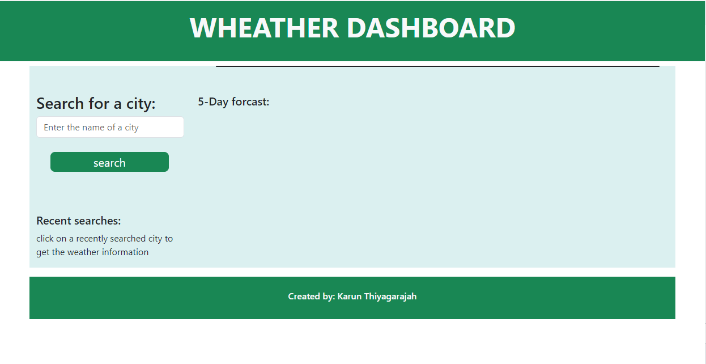
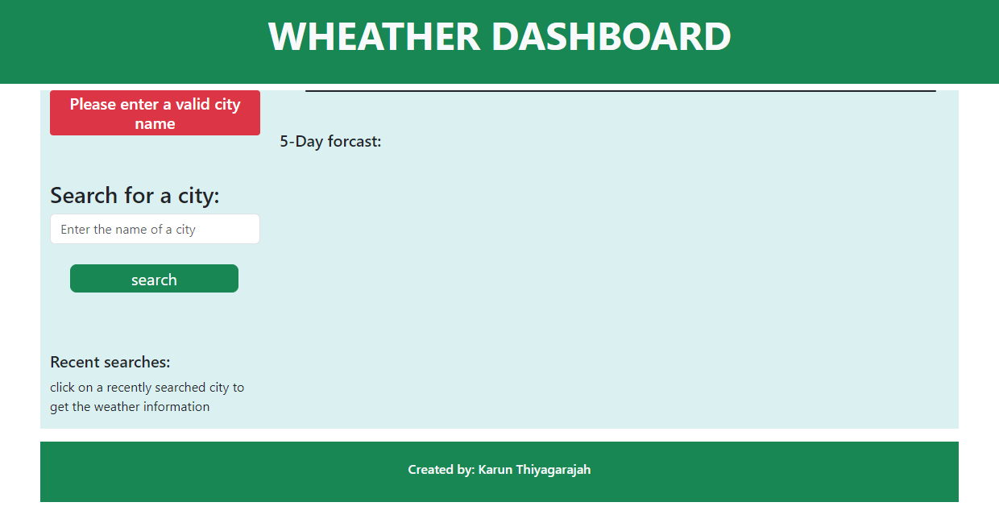
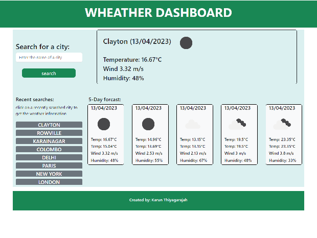
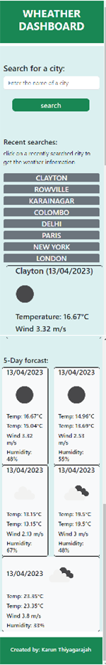

# weather-dashboard

## Description
This is an app to display the current information and a five day weather forcast.

The weather information can be obtained 
- through a new search. Enter a valid city name and click on search.
    

- when no city name is entered or the city does not exists in the database, a prompt is given at the top of the search area.
     

- When a search is compleated, the city name is added to the page under recent searches. Clicking on any of the recently searched cities wil populate the weather information for that city.
     

- the page is responsive.
     

## Installation
Click on this link - https://nanthantk.github.io/weather-dashboard/

   

